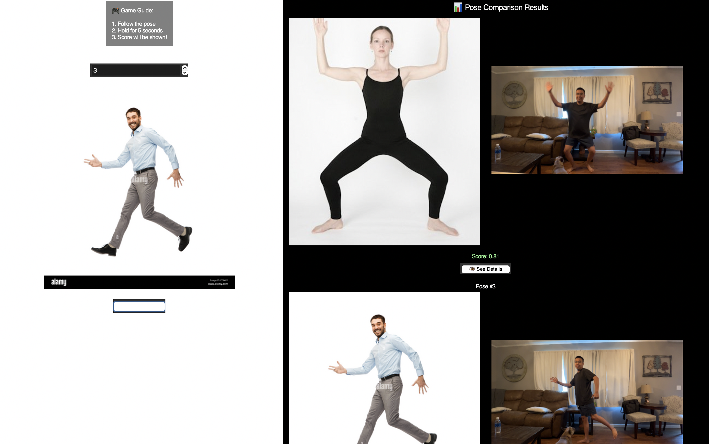
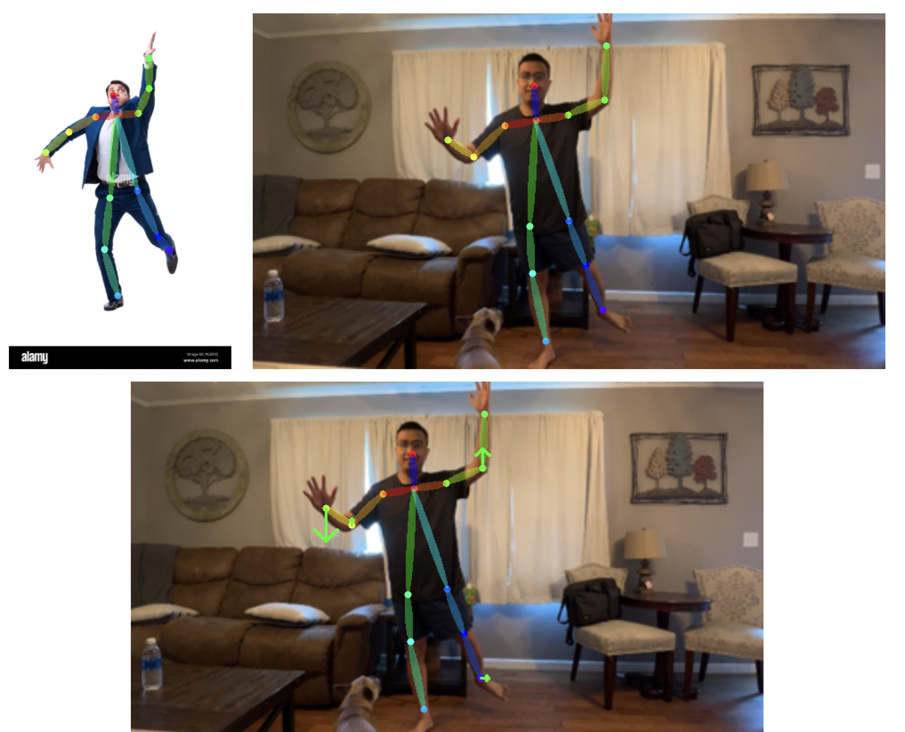

# 🕺 Pose Challenge Game 🎯

A real-time, webcam-based pose imitation game powered by AI pose estimation.  
Challenge yourself to mimic randomly generated poses, get scored based on your accuracy, and receive visual + textual feedback to improve your form.

---

## 🎮 Features

- 🔄 Random pose generation from a custom image set
- 📷 Real-time webcam capture and skeleton tracking (MediaPipe)
- 🧠 Pose similarity scoring using angle comparison
- 👁 “See Details” popup with pose overlay and textual feedback
- 🌀 GUI built with Tkinter for smooth interaction
---
After completing your posing, the results are displayed side-by-side, showing your best attempt next to the challenge pose, along with a similarity score


This is instruction image,

The length of the arrow corresponds to the distance you have to move and the direction of the arrow indicates the direction you should move.

This is instruction by text,

## 🚀 Getting Started

### 📦 Clone the repository

```bash
git clone https://github.com/yourusername/pose-challenge.git
cd pose-challenge

python3 -m venv venv
source venv/bin/activate
pip install -r requirements.txt
```

## 📚 Technologies Used
- Python
- MediaPipe
- OpenCV
- Tkinter
- Docker